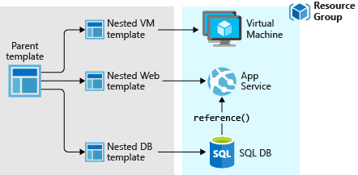
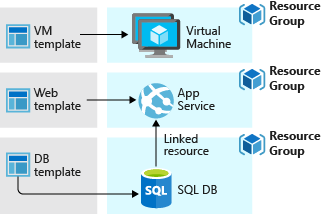

# ARM Templates
## Las plantillas de Resource Manager

La nube ha tomado cada vez mas relevancia, por ello muchos equipos han adoptado métodos de desarrollo más agiles, permitiéndoles iterar mas rápido. Tienen el objetivo de implementar repetidamente sus soluciones en la nube y saber que su infraestructura se encuentra en un estado confiable. Dado que la infraestructura se ha convertido en parte del proceso iterativo, ha desaparecido la división entre las operaciones y el desarrollo. Por ello, los equipos necesitan administrar la infraestructura y el código de aplicación a través de un proceso unificado.

Para cumplir estos desafíos, puede automatizar las implementaciones y usar la práctica de infraestructura como código. En el código, debe definir la infraestructura que debe ser implementada. Así pues, el código de infraestructura se convierte en parte del proyecto. Al igual que el código de la aplicación, puede almacenar el código de infraestructura en un repositorio de origen y agregarle un número de versión. Cualquier miembro del equipo podrá ejecutar el código e implementar entornos similares.


Azure ofrece soluciones para la implementación de la infraestructura como código, las cuales serian las plantillas de Azure Resource Manager (plantillas de ARM o ARM Templates). La plantilla es un archivo de notación de objetos JavaScript (JSON) que contiene la infraestructura y la configuración del proyecto. La plantilla usa sintaxis declarativa, lo que permite establecer lo que pretende implementar sin tener que escribir la secuencia de comandos de programación para crearla. En la plantilla se especifican los recursos que se van a implementar y las propiedades de esos recursos.

Esto implica que las plantillas ARM permitan parametrizar y automatizar la creación y despliegue de toda la infraestructura Azure necesaria en un proyecto (la web, el service plan, las bases de datos, etc.…) permitiendo de este modo, la creación de nuevos entornos exactamente iguales en cuestión de minutos y sin esfuerzo.

## Que beneficios ofrece el uso de plantillas ARM?

- Permite desplegar, gestionar y controlar los recursos para la solución que se ofrece como un solo grupo, en lugar de manejar estos recursos de manera individual.

- Permite implementar varias veces la solución a lo largo de todo el ciclo de vida del desarrollo, y tener la confianza de que estos recursos se desplegaran de forma correcta.
- Permite gestionar la infraestructura a través de plantillas declarativas en lugar de scripts.
Permite definir las dependencias entre los recursos para que se desplieguen en el orden correcto.
- Permite aplicar etiquetas a los recursos para organizarlos lógicamente en la suscripción.
- Permite ver la facturación de la organización mediante la visualización de los gastos para un grupo de recursos que comparten la misma etiqueta.


## Archivo de plantilla
Dentro de la plantilla, puede escribir expresiones de platinlla que aumentan las capacidades JSON.

Estas expresiones contiene las secciones siguiente:

- [Parametros](https://docs.microsoft.com/es-es/azure/azure-resource-manager/templates/parameters "Parametros en plantillas de ARM"): proporcione valores durante la implementacion que permitan usar la misma plantilla con entornos diferentes.

- [Variables](https://docs.microsoft.com/es-es/azure/azure-resource-manager/templates/variables "Variables en plantillas de ARM"): defina los valores que se reutilizan en las plantillas. Se pueden crear a partir de valores de parametros.
- [Funciones definidas por el usuario](https://docs.microsoft.com/es-es/azure/azure-resource-manager/templates/user-defined-functions "Funciones definidas por el usuario en plantillas de Resource Manager") cree funciones personalizadas que simplifiquen la plantilla.
- [Recursos](https://docs.microsoft.com/es-es/azure/azure-resource-manager/templates/resource-declaration "Declaración de recursos en plantillas de ARM"): especifique los recursos que se van a implementar.
- [Salidas](https://docs.microsoft.com/es-es/azure/azure-resource-manager/templates/outputs?tabs=azure-powershell "Salidas en plantillas de ARM"): devuelva valroes de los recursos implementados.

## Diseño de plantilla
La definición de plantillas y grupos de recursos depende únicamente de usted, al igual que la administración de la solución. Por ejemplo, puede implementar su aplicación de tres niveles a través de una única plantilla en un único grupo de recursos.


No obstante, no es necesario que defina toda la infraestructura en una sola plantilla. A menudo, tiene sentido dividir los requisitos de implementación en un conjunto de plantillas seleccionadas, específicas para un propósito. Estas plantillas se pueden reutilizar fácilmente para distintas soluciones. Para implementar una solución concreta, cree una plantilla principal que vincule todas las plantillas necesarias. La imagen siguiente muestra cómo implementar una solución de tres niveles mediante una plantilla principal que incluye tres plantillas anidadas.



Si desea que sus niveles tengan ciclos de vida independientes, puede implementar los tres niveles en grupos de recursos independientes. Observe que todavía se pueden vincular los recursos a los recursos de otros grupos.



## ¿Cómo crear una plantila ARM?

### Obtención de los recursos

Para empezar con el proceso de creacion de una plantilla ARM primero se debe obtener los recursos necesarios.

1. [Obtenga el modulo Az Powershell](https://docs.microsoft.com/es-ES/powershell/azure/install-az-ps?view=azps-7.5.0 "Instale el módulo Azure Az PowerShell"): El módulo Azure Az PowerShell es un módulo acumulativo. Al instalarlo, se descargan los módulos Az PowerShell generalmente disponibles y sus cmdlets están disponibles para su uso.

2. [Instale el CLI de AZURE en Windows](https://docs.microsoft.com/es-ES/cli/azure/install-azure-cli-windows?tabs=azure-cli "Instalación de la CLI de Azure en Windows"): En Windows, la CLI de Azure se instala mediante un archivo MSI que proporciona acceso a la CLI mediante el símbolo del sistema de Windows (CMD) o PowerShell.

3. Utilizando el comando `az --version` puede consultar la version de azure que tiene instalada.

4. Obtenga un buen editor de codigo: Las plantillas son archivos JSON por lo que se necesita un buen editor de codigo, una buena opción es [Visual Studio Code](https://code.visualstudio.com/Download "descargar Visual Studio Code").

### Creación de la primera plantilla
1. Para empezar, se abre Visual Studio Code y se instala la extensión de Herramientas de Resource Manager.


2. Se debe asignar una carpeta de trabajo para Visual Studio Code desde la cual se creara el archivo que recibira el nombre de *azuredeploy.json*

3. Creado el archivo se debe copiar y pegar el siguiente codigo JSON
```JSON
{
  "$schema": "https://schema.management.azure.com/schemas/2019-04-01/deploymentTemplate.json#",
  "contentVersion": "1.0.0.0",
  "resources": []
}
```
De este modo se ve en Visual Studio Code


Con esta plantilla no se implementa ningún recurso. Simplemente se muestra los pasos basicos a seguir para crear una plantilla ARM.

4. Se guarda el archivo y ya tiene su primera plantilla ARM creada.


### Para continuar los procesos de implementación puede seguir [este enlace](https://docs.microsoft.com/es-es/azure/azure-resource-manager/templates/template-tutorial-create-first-template?tabs=azure-powershell "Creación e implementación de plantilla ARM") donde se muestran los pasos para implementar la plantilla ARM
